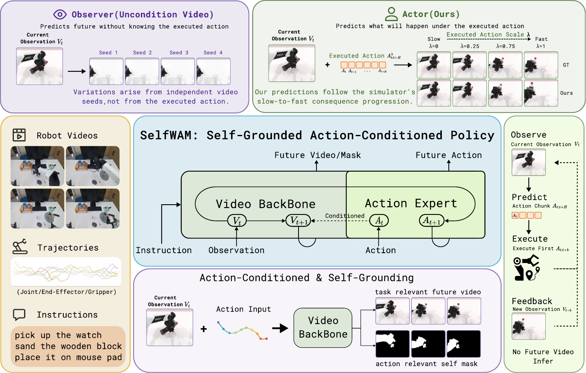

# SelfWAM: A Self-Grounded Unified World Action Model for Fast Robot Control

  
  
  
  

  

SelfWAM is a self-grounded world-action model built on Wan 2.2. Its
modality-specialized Mixture-of-Transformers (MoT) couples a pretrained video
backbone with a lightweight action expert. During joint training, future visual
queries can attend to a clean copy of the demonstrated action, while noisy
action-prediction queries cannot access that copy or future visual tokens. This
asymmetric structure turns future prediction into an action-conditioned
consequence model without changing the action-only inference path.

In addition to action-conditioned RGB prediction, SelfWAM introduces future
robot self-mask prediction as a training objective. Self-masks suppress
appearance and background details and focus visual learning on the robot's
visible, action-induced motion. Masks are used only as training targets; policy
inference uses RGB observations and requires neither masks nor a segmenter.

**Paper:** [arXiv:2608.00725](https://arxiv.org/abs/2608.00725) ·
**Project page:** [selfwam.github.io](https://selfwam.github.io/)
